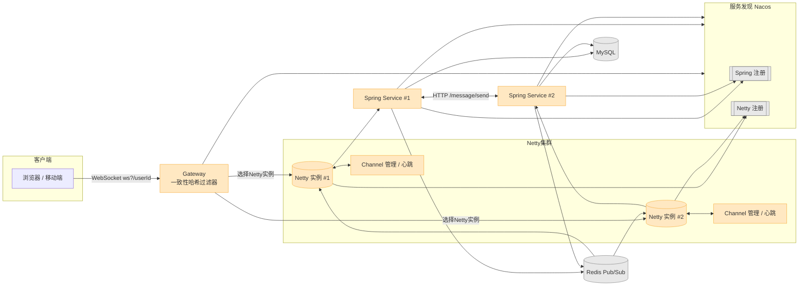
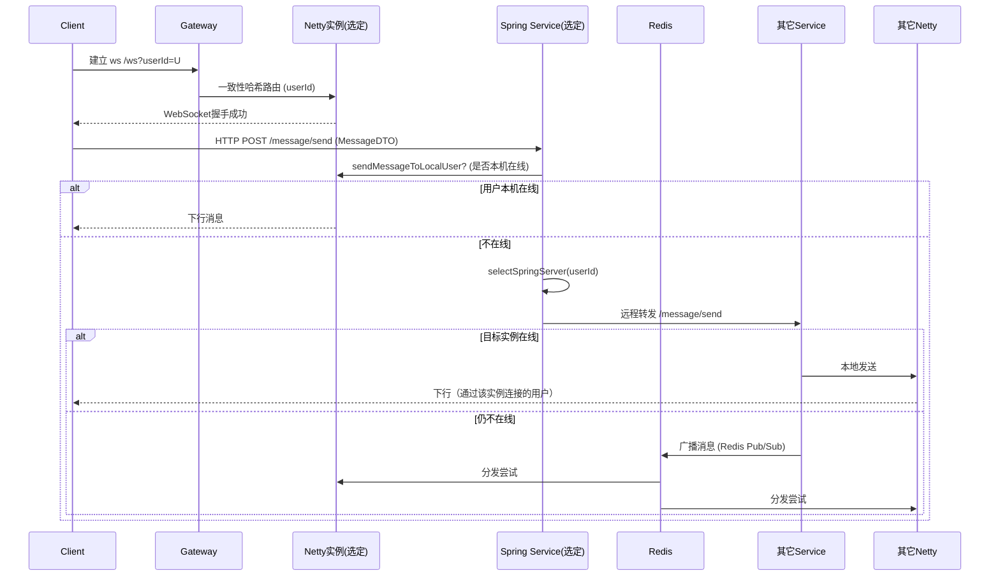
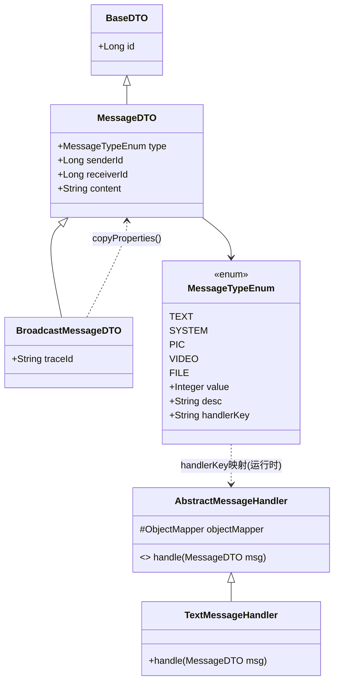
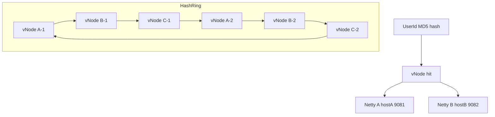
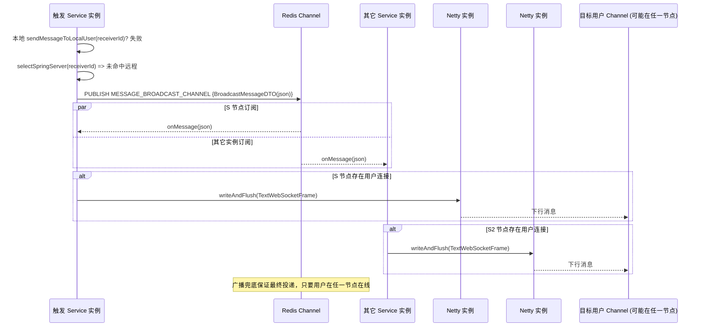
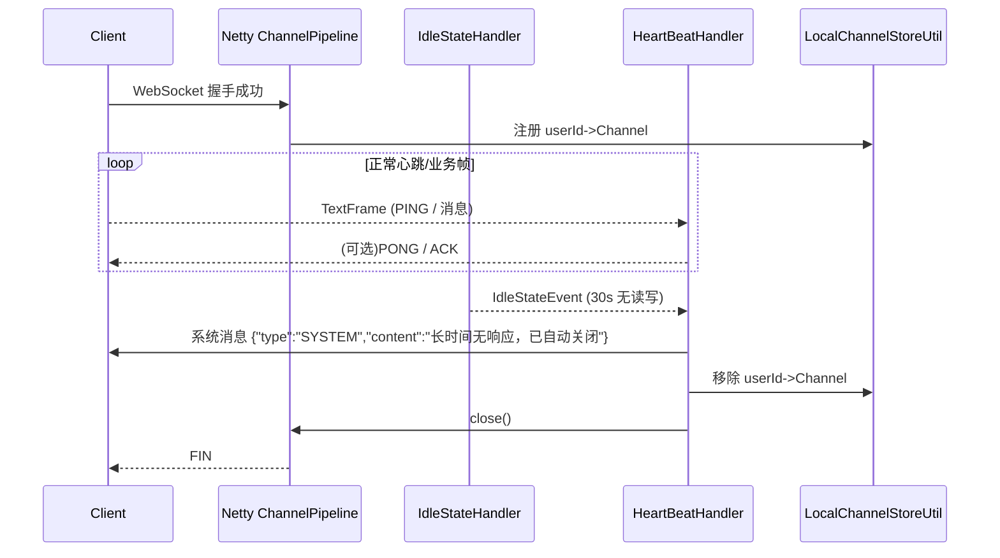

<div align="center">

# yl-IM 🔌💬

一个使用 Java 8 + Spring Boot 2.7 构建的分布式即时通讯 (IM) 系统示例，集成 Nacos、Redis、MySQL、Netty WebSocket，支持多实例水平扩展与一致性哈希用户路由。旨在作为学习分布式架构、长连接管理、消息路由与服务发现的开源参考实现。

</div>

> 注：本仓库为 IM 后端（Server/Backend）项目；配套 Flutter 前端仓库地址：
> https://github.com/Lee0110/yl-IM-flutter

## 目录

- [特性概览](#features)
- [模块说明](#modules)
- [架构与流程](#architecture)
- [消息协议 MessageDTO](#message-protocol)
- [一致性哈希路由说明](#consistent-hash)
- [心跳与连接管理](#connection)
- [快速开始（最小本地环境）](#quickstart)
- [安全 & 注意事项](#security)
- [后续可扩展方向](#future)
- [贡献](#contributing)
- [License](#license)

<a id="features"></a>
## ✨ 特性概览

- 基于 WebSocket 的长连接实时通信（Netty）
- Spring Cloud + Nacos 服务注册与发现（Spring 服务与 Netty 服务双注册）
- 一致性哈希选择 Netty 实例，保证同一用户稳定路由同一节点，减少跨节点迁移
- 用户消息路由：本地发送 -> 选定实例转发 -> Redis 广播兜底
- Redis 发布订阅实现跨实例广播消息
- 可水平扩展
- MDC TraceId 透传与系统消息心跳监测
- 代码分模块分层：api / common / core / gateway / netty / service

<a id="modules"></a>
## 🧩 模块说明

| 模块 | 作用 | 关键点 |
|------|------|--------|
| `yl-IM-common` | 通用基础类、枚举、工具 | `MessageTypeEnum`、`ConsistentHashUtil`、DTO 基类等 |
| `yl-IM-api` | 对外暴露的 DTO 与接口 | `MessageDTO`、`BroadcastMessageDTO` |
| `yl-IM-core` | 核心业务实现 | 消息发送流程、远程转发、广播逻辑 |
| `yl-IM-netty` | Netty WebSocket 长连接服务 | 连接握手认证、心跳、消息收发、Channel 管理 |
| `yl-IM-service` | Spring 业务服务实例 | 暴露 HTTP 接口（`/message/send`），整合 Redis / Nacos |
| `yl-IM-gateway` | Spring Cloud Gateway 网关 | WebSocket 路由 + 自定义一致性哈希过滤器 |
| `docker` | 本地依赖环境 | `mysql`、`redis`、`nacos`（以及可选 kafka/mongo/zookeeper） |

<a id="architecture"></a>
## 🏗 架构与流程

```text
Client --(ws /ws?userId=xxx)--> Gateway --(一致性哈希选择Netty实例)--> Netty节点
	 |                                                                   |
	 |<----------------------- 消息下行（TextWebSocketFrame）-----------|

							 ┌───────────── 消息发送路径 ─────────────┐
MessageController(/message/send)
				-> MessageService.sendMessageToLocalUser()
						 (本机有用户 => 直接下发)
				-> sendMessageToSelectedServer()
						 (本机无用户 => 一致性哈希定位远程 Spring 实例并 HTTP 转发)
				-> broadcastMessage()
						 (目标实例也无连接 => Redis Pub/Sub 广播兜底)
```

### Mermaid 架构总览



### 消息发送时序（本机 -> 远程 -> 广播兜底）



<a id="message-protocol"></a>
## 📨 消息协议 `MessageDTO`

WebSocket 与 HTTP 消息统一采用 JSON，核心结构如下：

```json
{
	"id": 123,             // BaseDTO 衍生，内部可选
	"type": "TEXT",       // 消息类型（见 MessageTypeEnum）
	"senderId": 10001,     // 发送者用户ID
	"receiverId": 20002,   // 接收者用户ID
	"content": "你好"      // 文本/系统/文件等内容
}
```

`BroadcastMessageDTO` 继承 `MessageDTO`，新增：

```json
{
	"traceId": "c3f9f4c2..." // 用于链路追踪
}
```

`MessageTypeEnum` 支持：`TEXT` / `SYSTEM` / `PIC` / `VIDEO` / `FILE`，枚举中包含对应 handlerKey，便于后续扩展多类型处理器。

### 类关系示意



> 说明：当前仓库里仅实现了 `TextMessageHandler`，其它类型可以按需扩展，同一枚举的 `handlerKey` 可与 `@Component` Bean 名称绑定。

<a id="consistent-hash"></a>
## 🔁 一致性哈希路由说明

`ConsistentHashUtil`：

- 使用虚拟节点（默认 160）提升分布均衡
- 基于 MD5 计算 hash -> 构建 TreeMap 哈希环
- 将环缓存到 Redis（默认过期 10 分钟），服务实例变更通过 Nacos 订阅回调触发 `clearCache()`
- `selectNettyServer(userId)` 返回 `host:port`，`selectSpringServer(userId)` 自动转换为对应 Spring 端口（Netty 端口 - 1000）

WebSocket 路由：Gateway 自定义 `CustomWebsocketGatewayFilter` 过滤器

1. 解析 `userId`（查询参数 / Header / 路径）
2. 一致性哈希选择 Netty 实例
3. 重写请求目标为 `ws://{ip:port}/ws?userId=xxx`

### 一致性哈希环示意（含虚拟节点）



### Redis Pub/Sub 广播时序



<a id="connection"></a>
## 🧪 心跳与连接管理

- `IdleStateHandler` 30 秒无读写触发事件
- `HeartBeatHandler` 发送系统提示并关闭闲置连接
- `AuthHandler` 在握手完成后验证并登记用户 Channel
- `LocalChannelStoreUtil` 管理用户与 Channel 的映射

### 心跳 & 断连时序



<a id="quickstart"></a>
## 🚀 快速开始（最小本地环境）

### 1. 启动依赖（Docker）

```bash
docker compose -f docker/docker-compose.yml up -d
```

包含：MySQL(13306)、Redis(6379)、Nacos(8848)、可选 Kafka/Zookeeper/Mongo。

### 2. 初始化数据库

创建库 `yl_im`（`docker-compose.yml` 已自动创建），按需导入表结构（当前示例未强依赖复杂表，可后续扩展）。

### 3. 启动 Gateway + 一个 IM 实例

默认端口：

- Spring 服务：`yl-IM-service` -> 8081
- Netty 服务：`yl-IM-service` 中的 Netty -> 9081
- Gateway：10001

确保 IDE 或命令行设置 `SPRING_PROFILES_ACTIVE=dev`。

### 4. 多实例扩展

第二个实例可覆盖端口：

```bash
# 示例（根据实际启动方式设置 JVM 参数或环境变量）
-Dserver.port=8082 -Dyl_IM.netty.server.port=9082
```

所有 Netty 服务都会注册到 Nacos，Gateway 会基于一致性哈希将用户路由到其中一个固定实例。

### 5. WebSocket 测试

连接示例：

```
ws://localhost:10001/ws?userId=10001
```

发送文本消息（浏览器或客户端）：

```json
{"type":"TEXT","senderId":10001,"receiverId":20002,"content":"你好"}
```

### 6. HTTP 消息发送接口

```
POST http://localhost:8081/message/send
Content-Type: application/json
{
	"type":"TEXT",
	"senderId":10001,
	"receiverId":20002,
	"content":"你好"
}
```

<a id="security"></a>
## 🔒 安全 & 注意事项

- Demo 中密码和端口为默认值，生产请替换为强密码并限制访问
- WebSocket 目前只做简单 userId 范围校验，建议后续接入 Token/JWT 鉴权
- 心跳超时策略可调整：`IdleStateHandler(0,0,30)`
- 广播机制使用 Redis Pub/Sub，若规模增大可考虑 Kafka 等消息中间件

<a id="future"></a>
## 📈 后续可扩展方向

- 消息持久化与离线补偿
- 已读回执与会话列表
- 图片/文件上传与 CDN 集成
- 分布式 Trace（OpenTelemetry）与指标采集（Prometheus + Grafana）
- 灰度与动态扩缩容（自适应虚拟节点数量）

<a id="contributing"></a>
## 🤝 贡献

欢迎提交 Issue / PR：

1. Fork 项目
2. 新建分支 `feature/xxx`
3. 提交修改并发起 Pull Request

<a id="license"></a>
## 📝 License

MIT License

---

如果这个项目对你有帮助，欢迎 Star 支持！⭐

